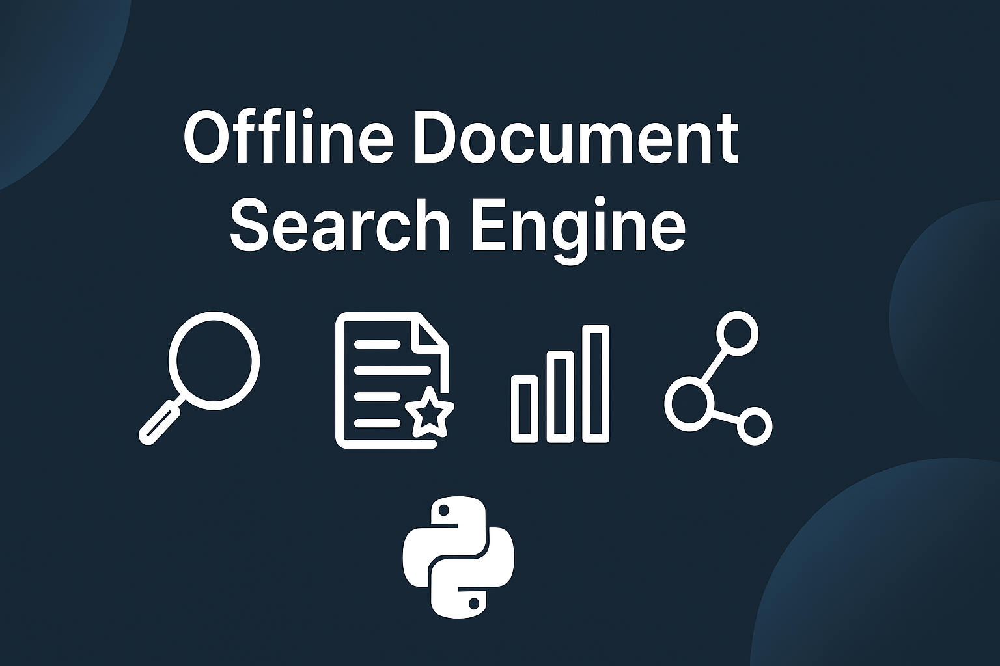

<p align="center">
  
</p>

# 📝 Offline Document Search Engine (Python)

A fast, lightweight, offline search engine built using **pure Python**.  
It indexes `.txt` files, performs keyword-based search, highlights matched lines, and provides document statistics — all without external libraries.

This project mimics the core behavior of a mini Google-style search engine:
- Inverted index  
- Term-frequency scoring  
- Line highlighting  
- Document similarity  
- Clean modular architecture  

---

## 🚀 Features

### 🔍 **1. Fast Keyword Search**
- Multi-word query support  
- Frequency-based ranking  
- Case-insensitive search  

### ✨ **2. Highlighted Matches**
Highlights query words inside documents using this format:

```
>>>python<<< is a powerful programming language
```

### 📊 **3. Document Statistics**
- Top 10 most frequent words  
- Vocabulary size  
- Jaccard similarity between two documents  

### 📁 **4. Automatic File Loading**
Automatically scans the `data/` folder and loads all `.txt` files.

### 🧱 **5. Clean Modular Code**
Each responsibility is handled by a dedicated module:
- `file_loader.py`  
- `text_cleaner.py`  
- `indexer.py`  
- `search_engine.py`  
- `highlighter.py`  
- `stats.py`  
- `main.py`  

---

## 🗂 Project Structure

```
document-search-engine/
│
├── data/
│   ├── sample1.txt
│   ├── sample2.txt
│   ├── sample_notes.txt
│   ├── tech_article1.txt
│   ├── tech_article2.txt
│   └── tech_article3.txt
│
├── src/
│   ├── file_loader.py
│   ├── text_cleaner.py
│   ├── indexer.py
│   ├── search_engine.py
│   ├── highlighter.py
│   ├── stats.py
│   └── main.py
│
└── README.md
```

---

## 🖥️ How to Run

### 1️⃣ Install Python 3.8+
Make sure Python is installed.

### 2️⃣ Open the project folder
```
cd document-search-engine
```

### 3️⃣ Run the main program
```
cd src
python main.py
```

---

## 🧪 Examples

### 🔍 Search Example
Input:
```
python data artificial
```

Output:
```
Results:
- tech_article1.txt (score: 12)
- sample1.txt (score: 6)
```

### ✨ Highlight Example
Extract from `sample1.txt`:
```
>>>python<<< is a powerful programming language
```

### 📊 Stats Example
```
Top Words:
python – 3
data – 2
computing – 1

Vocabulary Size: 145
```

### 🔗 Similarity Example
```
Similarity(sample1.txt vs tech_article1.txt): 0.312
```

---

## 🛠 Future Enhancements (Optional)
If you want to improve the project later:
- Phrase search: `"machine learning"`
- Search suggestions: spell correction  
- Synonym expansion (thesaurus-based)  
- Web UI (Flask)  
- PDF parsing  

---


## 📘 What I Learned

Building this project helped me understand and apply several fundamental software engineering and computer science concepts:

### 🔹 Inverted Indexing  
Implemented a fast lookup structure that maps words to documents and positions, similar to how real search engines work.

### 🔹 Text Processing & Normalization  
Practiced lowercasing, punctuation removal, and tokenization to ensure consistent, accurate search results.

### 🔹 Modular System Design  
Organized the project into clean, single-purpose components such as indexing, searching, highlighting, and analytics.

### 🔹 Ranking & Search Scoring  
Used frequency-based scoring to determine document relevance for any given query — a simplified version of real IR systems.

### 🔹 Highlight Extraction  
Built logic to extract matching lines and highlight keywords for improved readability and usability.

### 🔹 Document Analytics  
Learned how to implement word frequency counters, vocabulary measurements, and Jaccard similarity across documents.

### 🔹 CLI Interface Engineering  
Designed an intuitive, menu-driven command-line interface that ties all features together.

### 🔹 Git & Version Control  
Improved workflow by initializing a repo, committing changes, and pushing the project to GitHub in a clean, organized format.


## 👤 Author
Built entirely using pure Python as a learning + portfolio project.

---

